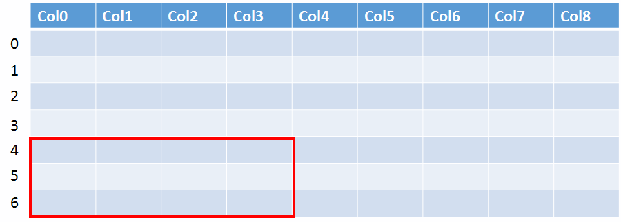
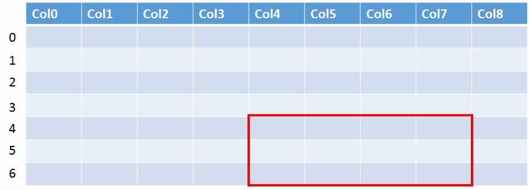
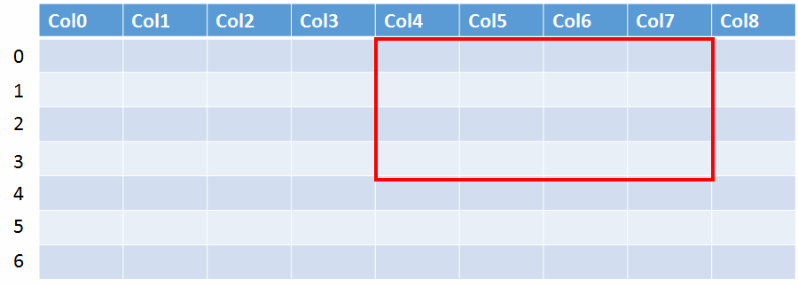

# Row Set API
The Row Sets API is used for retrieving row data that is contained in the SAS Viya ecosystem.

#### Context

The Row Sets API works in concert with the Data Sources and Data Tables APIs to navigate, reference, and retrieve data in the SAS Viya environment. The Row Set API enables retrieval of rectangular row data for data tables.

In the example below, a CAS table, titled AIRLINES, has the following columns: AIRLINE ID, NAME, ALIAS, IATA, ICAO, CALLSIGN, COUNTRY and ACTIVE.
For more information about navigating to a table, see the Data Tables API documentation.

### Differences Between Row Sets and Rows

Included in the `application/vnd.sas.data.table` resource are `rows` and `rowSet` links, which the user can follow to request either
`application/vnd.sas.collection` of `application/vnd.sas.data.row` or an `application/vnd.sas.data.row.set` resource respectively.
Use the `rows` link to get the full row of data for the table, regardless of the number of columns. Use the `rowSet` link to get rows of data for only certain columns or a range of columns.


## API Request Examples Grouped by Object Type

<details>
<summary>Rows</summary>

* [Retrieving Rows](#RetrievingRows)
</details>

<details>
<summary>Row Set</summary>

* [Retrieving a Row Set](#RetrievingRowSet)
* [Paginating Vertically and Horizontally](#Pagination)
* [Session Handling](#SessionHandling)
* [Query Parameters](#QueryParameters)
* [Link Relations](#LinkRelations)
</details>

<details>
<summary>Use Cases</summary>

* [Client Provides sessionId](#ClientProvidessessionId)
* [Client Does Not Specify sessionId](#ClientNoSessioinId)
* [Client Does Not Specify sessionId and specifies preserveSession=true](#ClientNoSessionIdPreserveSession)
</details>

### <a name='RetrievingRows'>Retrieving Rows</a>

The entry point into this service to retrieve row data should be from the
rows link of the media type `application/vnd.sas.data.table` from the Data Tables microservice.
For example, performing a GET request on the
`application/vnd.sas.data.table` resource below:

GET /dataTables/dataSources/cas~fs~casServer~fs~CasTestTmp/AIRLINES

**Rows Link from the application/vnd.sas.data.table**

```
{
      "method": "GET",
      "rel": "rows",
      "href": "/rowSets/tables/cas~fs~casServer~fs~CASTestTmp~fs~AIRLINES/rows",
      "uri": "/rowSets/tables/cas~fs~casServer~fs~CASTestTmp~fs~AIRLINES/rows",
      "type": "application/vnd.sas.collection",
      "itemType": "application/vnd.sas.data.row"
 }
```

Performing a GET request using the URI `/rowSets/tables/cas~fs~casServer~fs~CASTestTmp~fs~AIRLINES/rows` returns an
`application/vnd.sas.collection` resource containing `application/vnd.sas.data.row` resources.


#### Applying a WHERE Clause

A user can apply a WHERE clause to the `/rowSets/tables/cas~fs~casServer~fs~CASTestTmp~fs~AIRLINES/rows` collection by doing one of the following:
* POST `/rowSets/tables/cas~fs~casServer~fs~CASTestTmp~fs~AIRLINES/rows` with header Accept: text/plain and a request body of COUNTRY='Canada'
* GET `/rowSets/tables/cas~fs~casServer~fs~CASTestTmp~fs~AIRLINES/rows?where=COUNTRY='Canada'`

### <a name='RetrievingRowSet'>Retrieving a Row Set</a>

The entry point into this service to retrieve row data should be from the
rowSet link of the media type`application/vnd.sas.data.table` from the Data Tables microservice.
For example, performing a GET request on the `application/vnd.sas.data.table` resource below:

GET /dataTables/dataSources/cas~fs~casServer~fs~CasTestTmp/Airlines

**RowSet link from the application/vnd.sas.data.table**

```
{
      "method": "GET",
      "rel": "rowSet",
      "href": "/rowSets/tables/cas~fs~casServer~fs~CASTestTmp~fs~AIRLINES/rowSet",
      "uri": "/rowSets/tables/cas~fs~casServer~fs~CASTestTmp~fs~AIRLINES/rowSet",
      "type": "application/vnd.sas.data.row.set"
}
```

Performing a GET request using the URI `/rowSets/tables/cas~fs~casServer~fs~CASTestTmp~fs~AIRLINES/rows` returns the resource
`application/vnd.sas.data.row.set`.

#### Filter Cells by Column Name

By default, a GET request with the URL `/rowSets/tables/cas~fs~casServer~fs~CASTestTmp~fs~AIRLINES/rowSet` returns every cell in the row ordered by the column's natural ordering, which is by index, unless the `?columnSortBy` or `?includeColumns` query parameters are specified. If `?columnSortBy` is specified, the cells match the sorted column's order. If the `?includeColumns` query parameter is provided (example below), the returned cells are limited to, and in order of, the comma-separated list of column names.

GET /rowSets/tables/cas~fs~casServer~fs~CasTestTmp~fs~AIRLINES/rowSet?includeColumns=NAME,ALIAS,COUNTRY

**application/vnd.sas.row.set+json**

```
{
    "count": 6048,
    "start": 0,
    "limit": 10,
    "columnDetail": "names",
    "rows": [
        [
            "Private flight",
            "N",
            ""
        ],
        [
            "135 Airways",
            "N",
            "United States"
        ],
        [
            "1Time Airline",
            "N",
            "South Africa"
        ],
        [
            "2 Sqn No 1 Elementary Flying Training School",
            "N",
            "United Kingdom"
        ],
        [
            "213 Flight Unit",
            "N",
            "Russia"
        ],
        [
            "223 Flight Unit State Airline",
            "N",
            "Russia"
        ],
        [
            "224th Flight Unit",
            "N",
            "Russia"
        ],
        [
            "247 Jet Ltd",
            "N",
            "United Kingdom"
        ],
        [
            "3D Aviation",
            "N",
            "United States"
        ],
        [
            "40-Mile Air",
            "N",
            "United States"
        ]
    ],
    "columns": [
        "NAME",
        "ALIAS",
        "COUNTRY"
    ],
    "version": 1,
    "links": [
        {
            "method": "GET",
            "rel": "rowSet",
            "uri": "/rowSets/tables/cas~fs~casServer~fs~CASTestTmp~fs~AIRLINES/rowSet",
            "href": "/rowSets/tables/cas~fs~casServer~fs~CASTestTmp~fs~AIRLINES/rowSet",
            "type": "application/vnd.sas.data.row.set"
        },
        {
            "method": "GET",
            "rel": "self",
            "uri": "/rowSets/tables/cas~fs~casServer~fs~CASTestTmp~fs~AIRLINES/rowSet?start=0&limit=10&includeColumns=NAME,ALIAS,COUNTRY",
            "href": "/rowSets/tables/cas~fs~casServer~fs~CASTestTmp~fs~AIRLINES/rowSet?start=0&limit=10&includeColumns=NAME,ALIAS,COUNTRY",
            "type": "application/vnd.sas.data.row.set"
        },
        {
            "method": "GET",
            "rel": "first",
            "uri": "/rowSets/tables/cas~fs~casServer~fs~CASTestTmp~fs~AIRLINES/rowSet?start=0&limit=10&includeColumns=NAME,ALIAS,COUNTRY",
            "href": "/rowSets/tables/cas~fs~casServer~fs~CASTestTmp~fs~AIRLINES/rowSet?start=0&limit=10&includeColumns=NAME,ALIAS,COUNTRY",
            "type": "application/vnd.sas.data.row.set"
        },
        {
            "method": "GET",
            "rel": "next",
            "uri": "/rowSets/tables/cas~fs~casServer~fs~CASTestTmp~fs~AIRLINES/rowSet?start=10&limit=10&includeColumns=NAME,ALIAS,COUNTRY",
            "href": "/rowSets/tables/cas~fs~casServer~fs~CASTestTmp~fs~AIRLINES/rowSet?start=10&limit=10&includeColumns=NAME,ALIAS,COUNTRY",
            "type": "application/vnd.sas.data.row.set"
        },
        {
            "method": "GET",
            "rel": "last",
            "uri": "/rowSets/tables/cas~fs~casServer~fs~CASTestTmp~fs~AIRLINES/rowSet?start=6040&limit=10&includeColumns=NAME,ALIAS,COUNTRY",
            "href": "/rowSets/tables/cas~fs~casServer~fs~CASTestTmp~fs~AIRLINES/rowSet?start=6040&limit=10&includeColumns=NAME,ALIAS,COUNTRY",
            "type": "application/vnd.sas.data.row.set"
        },
        {
            "method": "GET",
            "rel": "table",
            "uri": "/dataTables/dataSources/cas~fs~casServer~fs~CASTestTmp/tables/AIRLINES",
            "href": "/dataTables/dataSources/cas~fs~casServer~fs~CASTestTmp/tables/AIRLINES",
            "type": "application/vnd.sas.data.table"
        }
    ]
}
```

#### Applying a WHERE Clause

The user can apply a WHERE clause to filter the returned rows of data using the `?where` query parameter. Note that the value of the `?where` query parameter must be URL encoded (i.e. Percent encoded). See example below:

GET /rowSets/tables/cas~fs~casServer~fs~CasTestTmp~fs~AIRLINES/rowSet?where=COUNTRY='Canada'  
URL Encoded Form: GET /rowSets/tables/cas~fs~casServer~fs~CasTestTmp~fs~AIRLINES/rowSet?where=COUNTRY%3D%27Canada%27

**application/vnd.sas.row.set+json**

```
{
    "count": 318,
    "start": 0,
    "limit": 10,
    "columnDetail": "names",
    "rows": [
        [
            "12",
            "611897 Alberta Limited",
            "N",
            "",
            "THD",
            "DONUT",
            "Canada",
            "N"
        ],
        [
            "17",
            "Aero Aviation Centre Ltd.",
            "N",
            "",
            "AAD",
            "SUNRISE",
            "Canada",
            "N"
        ],
        [
            "36",
            "Angus Aviation",
            "N",
            "",
            "AAZ",
            "ANGUS",
            "Canada",
            "N"
        ],
        [
            "44",
            "Alberta Citylink",
            "N",
            "",
            "ABK",
            "ALBERTA CITYLINK",
            "Canada",
            "N"
        ],
        [
            "61",
            "Air Charters",
            "N",
            "",
            "ACX",
            "PARAIR",
            "Canada",
            "N"
        ],
        [
            "82",
            "Avion Taxi",
            "N",
            "",
            "ADQ",
            "AIR DATA",
            "Canada",
            "N"
        ],
        [
            "85",
            "Air Dorval",
            "N",
            "",
            "ADT",
            "AIR DORVAL",
            "Canada",
            "N"
        ],
        [
            "87",
            "Advance Air Charters",
            "N",
            "",
            "ADV",
            "ADVANCE",
            "Canada",
            "N"
        ],
        [
            "91",
            "Air Southwest Ltd.",
            "N",
            "",
            "ASW",
            "AIRSOUTHWEST",
            "Canada",
            "N"
        ],
        [
            "107",
            "Air Alma",
            "N",
            "",
            "AAJ",
            "AIR ALMA",
            "Canada",
            "N"
        ]
    ],
    "columns": [
        "AIRLINE ID",
        "NAME",
        "ALIAS",
        "IATA",
        "ICAO",
        "CALLSIGN",
        "COUNTRY",
        "ACTIVE"
    ],
    "version": 1,
    "links": [
        {
            "method": "GET",
            "rel": "rowSet",
            "uri": "/rowSets/tables/cas~fs~casServer~fs~CASTestTmp~fs~AIRLINES/rowSet",
            "href": "/rowSets/tables/cas~fs~casServer~fs~CASTestTmp~fs~AIRLINES/rowSet",
            "type": "application/vnd.sas.data.row.set"
        },
        {
            "method": "GET",
            "rel": "self",
            "uri": "/rowSets/tables/cas~fs~casServer~fs~CASTestTmp~fs~AIRLINES/rowSet?start=0&limit=10&where=COUNTRY%3D%27Canada%27",
            "href": "/rowSets/tables/cas~fs~casServer~fs~CASTestTmp~fs~AIRLINES/rowSet?start=0&limit=10&where=COUNTRY%3D%27Canada%27",
            "type": "application/vnd.sas.data.row.set"
        },
        {
            "method": "GET",
            "rel": "first",
            "uri": "/rowSets/tables/cas~fs~casServer~fs~CASTestTmp~fs~AIRLINES/rowSet?start=0&limit=10&where=COUNTRY%3D%27Canada%27",
            "href": "/rowSets/tables/cas~fs~casServer~fs~CASTestTmp~fs~AIRLINES/rowSet?start=0&limit=10&where=COUNTRY%3D%27Canada%27",
            "type": "application/vnd.sas.data.row.set"
        },
        {
            "method": "GET",
            "rel": "next",
            "uri": "/rowSets/tables/cas~fs~casServer~fs~CASTestTmp~fs~AIRLINES/rowSet?start=10&limit=10&where=COUNTRY%3D%27Canada%27",
            "href": "/rowSets/tables/cas~fs~casServer~fs~CASTestTmp~fs~AIRLINES/rowSet?start=10&limit=10&where=COUNTRY%3D%27Canada%27",
            "type": "application/vnd.sas.data.row.set"
        },
        {
            "method": "GET",
            "rel": "last",
            "uri": "/rowSets/tables/cas~fs~casServer~fs~CASTestTmp~fs~AIRLINES/rowSet?start=310&limit=10&where=COUNTRY%3D%27Canada%27",
            "href": "/rowSets/tables/cas~fs~casServer~fs~CASTestTmp~fs~AIRLINES/rowSet?start=310&limit=10&where=COUNTRY%3D%27Canada%27",
            "type": "application/vnd.sas.data.row.set"
        },
        {
            "method": "GET",
            "rel": "table",
            "uri": "/dataTables/dataSources/cas~fs~casServer~fs~CASTestTmp/tables/AIRLINES",
            "href": "/dataTables/dataSources/cas~fs~casServer~fs~CASTestTmp/tables/AIRLINES",
            "type": "application/vnd.sas.data.table"
        }
    ]
}
```

### <a name='Pagination'>Paginating Vertically and Horizontally</a>

The `application/vnd.sas.data.row.set` can paginate over wide data tables either vertically or horizontally.
The API standard pagination, with its respective set of standard links of `next`, `prev`, `first` and `last`, paginate vertically.
The row set includes a similar set of links for paging horizontally, which are `right`, `left`, `leftMost` and `rightMost`.
For example, the row set below was retrieved by the URL `/rowSets/tables/exampleTableId/rowSet?start=0&limit=4&columnStart=0&columnLimit=4`.
This retrieves the portion of the data table highlighted in red, which is a set of 4 rows that are 4 columns wide starting at row and column index of 0.


The standard pagination link `next` moves the row set vertically down the table with the URL `/rowSets/tables/exampleTableId/rowSet?start=4&limit=4&columnStart=0&columnLimit=4`:



If you want to move horizontally along the table, use the `right` link with the URL `/rowSets/tables/exampleTableId/rowSet?start=4&limit=4&columnStart=4&columnLimit=4`:



The `prev` link can move back up the table using the URL `/rowSets/tables/exampleTableId/rowSet?start=0&limit=4&columnStart=4&columnLimit=4`:



You can follow the `left` or `leftMost` links to return to the beginning with the URL `/rowSets/tables/exampleTableId/rowSet?start=0&limit=4&columnStart=0&columnLimit=4`:


### <a name='SessionHandling'>Session Handling</a>

Certain Row Sets service providers support session-based data retrieval.
To determine whether this is supported by any particular provider, you can query `/rowSets/providers/{providerId}` to retrieve the media type
`application/vnd.sas.data.provider` and check if the `usesSessions` member.

### <a name='QueryParameters'>Query Parameters</a>

If sessions are supported by the provider, the following query parameters are supported for calls to `/rowSets/tables/{tableId}/rows` and `/rowSets/tables/{tableId}/rowSet`:

| Name               | Type      | Description                                                                                                                                                                                                                                                                                                                                                                                                                                                                                                                                                                                        |
|--------------------|-----------|----------------------------------------------------------------------------------------------------------------------------------------------------------------------------------------------------------------------------------------------------------------------------------------------------------------------------------------------------------------------------------------------------------------------------------------------------------------------------------------------------------------------------------------------------------------------------------------------------|
| `?sessionId`       | `string`  | The unique identifier of the session used to access the data service provider's backing service. When this is not specified, the data service provider creates a temporary session, and then destroys it after the request is complete. If this is specified, all returned links, except the "self" link, will have the sessionId query parameter added to their respective URIs. Also, they will contain an additional session link to the application/vnd.sas.data.session resource that corresponds to the provided sessionId.                                                                  |
| `?preserveSession` | `boolean` | This has effect only when the `?sessionId` query parameter is not specified. If this is set to true, no `?sessionId` is provided, the session created by the data service provider will not be destroyed. All returned links, except the "self" link, will have the `?sessionId`query parameter added to their respective URIs. Also, they will contain an additional session link to the application/vnd.sas.data.session resource that corresponds to the provided `?sessionId`. If set to false or not specified, the session will be destroyed after the request is complete. Defaults to false. |

### <a name='Link Relations'>Link Relations</a>

#### session link

The `session` link is added anytime the `sessionId` is provided by the user or the `preserveSession` query parameter is set to true.
This `session` link should be the `application/vnd.sas.data.session`, and the href should be `/dataSources/providers/{providerId}/sources/{sourceId}/sessions/{sessionId}`.
This is provided so that the client can obtain further links to destroy the session if they wish to destroy the session.

#### sessionScoped link

The `sessionScoped` link is added anytime the `sessionId` is provided by the user or the `preserveSession` query parameter is set to true. This link gives the user access to a session-scoped version of the `self` link, and ensures they understand that they are working with a temporary session. The `self` link must be the resource identifier that the user persists. The `sessionScoped` link can be used for immediate access and for work being done with the resource by the client.

### <a name='ClientProvidessessionId'>Use Case: Client Provides sessionId</a>

In the case of the user already knowing their session identifier, they can pass it as the query parameter `sessionId`.
This session identifier is used when establishing a connection to the data service provider's backing service (e.g. CAS).
If the sessionId does not exist, a 404 error is returned.
Also, a session link should be provided that points to the appropriate session in the path `/dataSources/providers/{providerId}/sources/{sourceId}/sessions/{sessionId}` where `sourceId` corresponds to the level of the data hierarchy that the session is associated with (e.g. for CAS it would be the first level cas server). The `sessionId` should be appended as a query parameter to all links except the `self` link, and the `sessionScoped` link to the respective resource should be added.

**Example CAS Data Provider Row Set**

```
# HTTP GET request to get a row set passing their session identifier as the query parameter sessionId
GET /rowSets/tables/cas~fs~casServer~fs~CASTestTmp~fs~AIRLINES/rowSet?sessionId=d5272d22-ef57-4761-8b80-4998f114cc96
#Response application/vnd.sas.data.row.set+json
```

```
{
    "count": 318,
    "start": 0,
    "limit": 10,
    "columnLimit": 25,
    "columnStart": 0,
    "columnCount": 8,
    "columnDetail": "names",
    "rows": [
        [
            "12",
            "611897 Alberta Limited",
            "N",
            "",
            "THD",
            "DONUT",
            "Canada",
            "N"
        ],
        [
            "17",
            "Aero Aviation Centre Ltd.",
            "N",
            "",
            "AAD",
            "SUNRISE",
            "Canada",
            "N"
        ],
        [
            "36",
            "Angus Aviation",
            "N",
            "",
            "AAZ",
            "ANGUS",
            "Canada",
            "N"
        ],
        [
            "44",
            "Alberta Citylink",
            "N",
            "",
            "ABK",
            "ALBERTA CITYLINK",
            "Canada",
            "N"
        ],
        [
            "61",
            "Air Charters",
            "N",
            "",
            "ACX",
            "PARAIR",
            "Canada",
            "N"
        ],
        [
            "82",
            "Avion Taxi",
            "N",
            "",
            "ADQ",
            "AIR DATA",
            "Canada",
            "N"
        ],
        [
            "85",
            "Air Dorval",
            "N",
            "",
            "ADT",
            "AIR DORVAL",
            "Canada",
            "N"
        ],
        [
            "87",
            "Advance Air Charters",
            "N",
            "",
            "ADV",
            "ADVANCE",
            "Canada",
            "N"
        ],
        [
            "91",
            "Air Southwest Ltd.",
            "N",
            "",
            "ASW",
            "AIRSOUTHWEST",
            "Canada",
            "N"
        ],
        [
            "107",
            "Air Alma",
            "N",
            "",
            "AAJ",
            "AIR ALMA",
            "Canada",
            "N"
        ]
    ],
    "columns": [
        "AIRLINE ID",
        "NAME",
        "ALIAS",
        "IATA",
        "ICAO",
        "CALLSIGN",
        "COUNTRY",
        "ACTIVE"
    ],
    "version": 1,
    "links": [
        {
            "method": "GET",
            "rel": "rowSet",
            "uri": "/rowSets/tables/cas~fs~casServer~fs~CASTestTmp~fs~AIRLINES/rowSet?sessionId=d5272d22-ef57-4761-8b80-4998f114cc96",
            "href": "/rowSets/tables/cas~fs~casServer~fs~CASTestTmp~fs~AIRLINES/rowSet?sessionId=d5272d22-ef57-4761-8b80-4998f114cc96",
            "type": "application/vnd.sas.data.row.set"
        },
        {
            "method": "GET",
            "rel": "self",
            "uri": "/rowSets/tables/cas~fs~casServer~fs~CASTestTmp~fs~AIRLINES/rowSet?start=0&limit=10&where=COUNTRY%3D%27Canada%27",
            "href": "/rowSets/tables/cas~fs~casServer~fs~CASTestTmp~fs~AIRLINES/rowSet?start=0&limit=10&where=COUNTRY%3D%27Canada%27",
            "type": "application/vnd.sas.data.row.set"
        },
        {
            "method": "GET",
            "rel": "sessionScoped",
            "uri": "/rowSets/tables/cas~fs~casServer~fs~CASTestTmp~fs~AIRLINES/rowSet?start=0&limit=10&where=COUNTRY%3D%27Canada%27&sessionId=d5272d22-ef57-4761-8b80-4998f114cc96",
            "href": "/rowSets/tables/cas~fs~casServer~fs~CASTestTmp~fs~AIRLINES/rowSet?start=0&limit=10&where=COUNTRY%3D%27Canada%27&sessionId=d5272d22-ef57-4761-8b80-4998f114cc96",
            "type": "application/vnd.sas.data.row.set"
        },
        {
            "method": "GET",
            "rel": "session",
            "uri": "/dataSources/providers/cas/sources/casServer/sessions/d5272d22-ef57-4761-8b80-4998f114cc96",
            "href": "/dataSources/providers/cas/sources/casServer/sessions/d5272d22-ef57-4761-8b80-4998f114cc96",
            "type": "application/vnd.sas.data.session"
        },
        {
            "method": "GET",
            "rel": "first",
            "uri": "/rowSets/tables/cas~fs~casServer~fs~CASTestTmp~fs~AIRLINES/rowSet?start=0&limit=10&where=COUNTRY%3D%27Canada%27&sessionId=d5272d22-ef57-4761-8b80-4998f114cc96",
            "href": "/rowSets/tables/cas~fs~casServer~fs~CASTestTmp~fs~AIRLINES/rowSet?start=0&limit=10&where=COUNTRY%3D%27Canada%27&sessionId=d5272d22-ef57-4761-8b80-4998f114cc96",
            "type": "application/vnd.sas.data.row.set"
        },
        {
            "method": "GET",
            "rel": "next",
            "uri": "/rowSets/tables/cas~fs~casServer~fs~CASTestTmp~fs~AIRLINES/rowSet?start=10&limit=10&where=COUNTRY%3D%27Canada%27&sessionId=d5272d22-ef57-4761-8b80-4998f114cc96",
            "href": "/rowSets/tables/cas~fs~casServer~fs~CASTestTmp~fs~AIRLINES/rowSet?start=10&limit=10&where=COUNTRY%3D%27Canada%27&sessionId=d5272d22-ef57-4761-8b80-4998f114cc96",
            "type": "application/vnd.sas.data.row.set"
        },
        {
            "method": "GET",
            "rel": "last",
            "uri": "/rowSets/tables/cas~fs~casServer~fs~CASTestTmp~fs~AIRLINES/rowSet?start=310&limit=10&where=COUNTRY%3D%27Canada%27&sessionId=d5272d22-ef57-4761-8b80-4998f114cc96",
            "href": "/rowSets/tables/cas~fs~casServer~fs~CASTestTmp~fs~AIRLINES/rowSet?start=310&limit=10&where=COUNTRY%3D%27Canada%27&sessionId=d5272d22-ef57-4761-8b80-4998f114cc96",
            "type": "application/vnd.sas.data.row.set"
        },
        {
            "method": "GET",
            "rel": "up",
            "uri": "/dataTables/dataSources/cas~fs~casServer~fs~CASTestTmp/tables/AIRLINES?sessionId=d5272d22-ef57-4761-8b80-4998f114cc96",
            "href": "/dataTables/dataSources/cas~fs~casServer~fs~CASTestTmp/tables/AIRLINES?sessionId=d5272d22-ef57-4761-8b80-4998f114cc96",
            "type": "application/vnd.sas.data.table"
        }
    ]
}
```

### <a name='ClientNoSessioinId'>Use Case: Client Does Not Specify sessionId</a>

If the user does not provide the session identifier, it is the responsibility of the data provider service to create a temporary session to request the data from the backing service, and then delete that session upon completion of the request.

**Example CAS Data Provider Row Set**

```
# HTTP GET request to get a row set that doesn't specify a sessionId
GET /rowSets/tables/cas~fs~casServer~fs~CASTestTmp~fs~AIRLINES/rowSet
#Response application/vnd.sas.data.row.set+json
```

```
{
    "count": 318,
    "start": 0,
    "limit": 10,
    "columnLimit": 25,
    "columnStart": 0,
    "columnCount": 8,
    "columnDetail": "names",
    "rows": [
        [
            "12",
            "611897 Alberta Limited",
            "N",
            "",
            "THD",
            "DONUT",
            "Canada",
            "N"
        ],
        [
            "17",
            "Aero Aviation Centre Ltd.",
            "N",
            "",
            "AAD",
            "SUNRISE",
            "Canada",
            "N"
        ],
        [
            "36",
            "Angus Aviation",
            "N",
            "",
            "AAZ",
            "ANGUS",
            "Canada",
            "N"
        ],
        [
            "44",
            "Alberta Citylink",
            "N",
            "",
            "ABK",
            "ALBERTA CITYLINK",
            "Canada",
            "N"
        ],
        [
            "61",
            "Air Charters",
            "N",
            "",
            "ACX",
            "PARAIR",
            "Canada",
            "N"
        ],
        [
            "82",
            "Avion Taxi",
            "N",
            "",
            "ADQ",
            "AIR DATA",
            "Canada",
            "N"
        ],
        [
            "85",
            "Air Dorval",
            "N",
            "",
            "ADT",
            "AIR DORVAL",
            "Canada",
            "N"
        ],
        [
            "87",
            "Advance Air Charters",
            "N",
            "",
            "ADV",
            "ADVANCE",
            "Canada",
            "N"
        ],
        [
            "91",
            "Air Southwest Ltd.",
            "N",
            "",
            "ASW",
            "AIRSOUTHWEST",
            "Canada",
            "N"
        ],
        [
            "107",
            "Air Alma",
            "N",
            "",
            "AAJ",
            "AIR ALMA",
            "Canada",
            "N"
        ]
    ],
    "columns": [
        "AIRLINE ID",
        "NAME",
        "ALIAS",
        "IATA",
        "ICAO",
        "CALLSIGN",
        "COUNTRY",
        "ACTIVE"
    ],
    "version": 1,
    "links": [
        {
            "method": "GET",
            "rel": "rowSet",
            "uri": "/rowSets/tables/cas~fs~casServer~fs~CASTestTmp~fs~AIRLINES/rowSet",
            "href": "/rowSets/tables/cas~fs~casServer~fs~CASTestTmp~fs~AIRLINES/rowSet",
            "type": "application/vnd.sas.data.row.set"
        },
        {
            "method": "GET",
            "rel": "self",
            "uri": "/rowSets/tables/cas~fs~casServer~fs~CASTestTmp~fs~AIRLINES/rowSet?start=0&limit=10&where=COUNTRY%3D%27Canada%27",
            "href": "/rowSets/tables/cas~fs~casServer~fs~CASTestTmp~fs~AIRLINES/rowSet?start=0&limit=10&where=COUNTRY%3D%27Canada%27",
            "type": "application/vnd.sas.data.row.set"
        },
        {
            "method": "GET",
            "rel": "first",
            "uri": "/rowSets/tables/cas~fs~casServer~fs~CASTestTmp~fs~AIRLINES/rowSet?start=0&limit=10&where=COUNTRY%3D%27Canada%27",
            "href": "/rowSets/tables/cas~fs~casServer~fs~CASTestTmp~fs~AIRLINES/rowSet?start=0&limit=10&where=COUNTRY%3D%27Canada%27",
            "type": "application/vnd.sas.data.row.set"
        },
        {
            "method": "GET",
            "rel": "next",
            "uri": "/rowSets/tables/cas~fs~casServer~fs~CASTestTmp~fs~AIRLINES/rowSet?start=10&limit=10&where=COUNTRY%3D%27Canada%27",
            "href": "/rowSets/tables/cas~fs~casServer~fs~CASTestTmp~fs~AIRLINES/rowSet?start=10&limit=10&where=COUNTRY%3D%27Canada%27",
            "type": "application/vnd.sas.data.row.set"
        },
        {
            "method": "GET",
            "rel": "last",
            "uri": "/rowSets/tables/cas~fs~casServer~fs~CASTestTmp~fs~AIRLINES/rowSet?start=310&limit=10&where=COUNTRY%3D%27Canada%27",
            "href": "/rowSets/tables/cas~fs~casServer~fs~CASTestTmp~fs~AIRLINES/rowSet?start=310&limit=10&where=COUNTRY%3D%27Canada%27",
            "type": "application/vnd.sas.data.row.set"
        },
        {
            "method": "GET",
            "rel": "up",
            "uri": "/dataTables/dataSources/cas~fs~casServer~fs~CASTestTmp/tables/AIRLINES",
            "href": "/dataTables/dataSources/cas~fs~casServer~fs~CASTestTmp/tables/AIRLINES",
            "type": "application/vnd.sas.data.table"
        }
    ]
}
```

### <a name='ClientNoSessionIdPreserveSession'>Use Case: Client Does Not Specify sessionId and specifies preserveSession=true</a>

If the user does not provide the session identifier, it is the responsibility of the data provider service to create a temporary session to request the data from the backing service, and then delete that session upon completion of the request. However, if the user sets the `preserveSession` query parameter to true then that temporary session should be preserved and placed on the returned links.
In the example below, the session identifier b51875c6-0561-45e1-bad3-ea7c2053d65f is the temporal session that is preserved. Also, a session link should be provided that points to the appropriate session in the path `/dataSources/providers/{providerId}/sources/{sourceId}/sessions/{sessionId}` where `sourceId` corresponds to the level of the data hierarchy that the session is associated with (e.g. for CAS it would be the first level cas server).
The `sessionId` should be appended as a query parameter to all links except the `self` link, and the `sessionScoped` link to the respective resource should be added.

**Example CAS Data Provider Row Set**

```
# HTTP GET request to get a row set passing their session identifier as the query parameter sessionId
GET /rowSets/tables/cas~fs~casServer~fs~CASTestTmp~fs~AIRLINES/rowSet?preserveSession=true
#Response application/vnd.sas.data.row.set+json
```
```
{
    "count": 318,
    "start": 0,
    "limit": 10,
    "columnLimit": 25,
    "columnStart": 0,
    "columnCount": 8,
    "columnDetail": "names",
    "rows": [
        [
            "12",
            "611897 Alberta Limited",
            "N",
            "",
            "THD",
            "DONUT",
            "Canada",
            "N"
        ],
        [
            "17",
            "Aero Aviation Centre Ltd.",
            "N",
            "",
            "AAD",
            "SUNRISE",
            "Canada",
            "N"
        ],
        [
            "36",
            "Angus Aviation",
            "N",
            "",
            "AAZ",
            "ANGUS",
            "Canada",
            "N"
        ],
        [
            "44",
            "Alberta Citylink",
            "N",
            "",
            "ABK",
            "ALBERTA CITYLINK",
            "Canada",
            "N"
        ],
        [
            "61",
            "Air Charters",
            "N",
            "",
            "ACX",
            "PARAIR",
            "Canada",
            "N"
        ],
        [
            "82",
            "Avion Taxi",
            "N",
            "",
            "ADQ",
            "AIR DATA",
            "Canada",
            "N"
        ],
        [
            "85",
            "Air Dorval",
            "N",
            "",
            "ADT",
            "AIR DORVAL",
            "Canada",
            "N"
        ],
        [
            "87",
            "Advance Air Charters",
            "N",
            "",
            "ADV",
            "ADVANCE",
            "Canada",
            "N"
        ],
        [
            "91",
            "Air Southwest Ltd.",
            "N",
            "",
            "ASW",
            "AIRSOUTHWEST",
            "Canada",
            "N"
        ],
        [
            "107",
            "Air Alma",
            "N",
            "",
            "AAJ",
            "AIR ALMA",
            "Canada",
            "N"
        ]
    ],
    "columns": [
        "AIRLINE ID",
        "NAME",
        "ALIAS",
        "IATA",
        "ICAO",
        "CALLSIGN",
        "COUNTRY",
        "ACTIVE"
    ],
    "version": 1,
    "links": [
        {
            "method": "GET",
            "rel": "rowSet",
            "uri": "/rowSets/tables/cas~fs~casServer~fs~CASTestTmp~fs~AIRLINES/rowSet?sessionId=b51875c6-0561-45e1-bad3-ea7c2053d65f",
            "href": "/rowSets/tables/cas~fs~casServer~fs~CASTestTmp~fs~AIRLINES/rowSet?sessionId=b51875c6-0561-45e1-bad3-ea7c2053d65f",
            "type": "application/vnd.sas.data.row.set"
        },
        {
            "method": "GET",
            "rel": "self",
            "uri": "/rowSets/tables/cas~fs~casServer~fs~CASTestTmp~fs~AIRLINES/rowSet?start=0&limit=10&where=COUNTRY%3D%27Canada%27",
            "href": "/rowSets/tables/cas~fs~casServer~fs~CASTestTmp~fs~AIRLINES/rowSet?start=0&limit=10&where=COUNTRY%3D%27Canada%27",
            "type": "application/vnd.sas.data.row.set"
        },
        {
            "method": "GET",
            "rel": "sessionScoped",
            "uri": "/rowSets/tables/cas~fs~casServer~fs~CASTestTmp~fs~AIRLINES/rowSet?start=0&limit=10&where=COUNTRY%3D%27Canada%27&sessionId=b51875c6-0561-45e1-bad3-ea7c2053d65f",
            "href": "/rowSets/tables/cas~fs~casServer~fs~CASTestTmp~fs~AIRLINES/rowSet?start=0&limit=10&where=COUNTRY%3D%27Canada%27&sessionId=b51875c6-0561-45e1-bad3-ea7c2053d65f",
            "type": "application/vnd.sas.data.row.set"
        },
        {
            "method": "GET",
            "rel": "session",
            "uri": "/dataSources/providers/cas/sources/casServer/sessions/b51875c6-0561-45e1-bad3-ea7c2053d65f",
            "href": "/dataSources/providers/cas/sources/casServer/sessions/b51875c6-0561-45e1-bad3-ea7c2053d65f",
            "type": "application/vnd.sas.data.session"
        },
        {
            "method": "GET",
            "rel": "first",
            "uri": "/rowSets/tables/cas~fs~casServer~fs~CASTestTmp~fs~AIRLINES/rowSet?start=0&limit=10&where=COUNTRY%3D%27Canada%27&sessionId=b51875c6-0561-45e1-bad3-ea7c2053d65f",
            "href": "/rowSets/tables/cas~fs~casServer~fs~CASTestTmp~fs~AIRLINES/rowSet?start=0&limit=10&where=COUNTRY%3D%27Canada%27&sessionId=b51875c6-0561-45e1-bad3-ea7c2053d65f",
            "type": "application/vnd.sas.data.row.set"
        },
        {
            "method": "GET",
            "rel": "next",
            "uri": "/rowSets/tables/cas~fs~casServer~fs~CASTestTmp~fs~AIRLINES/rowSet?start=10&limit=10&where=COUNTRY%3D%27Canada%27&sessionId=b51875c6-0561-45e1-bad3-ea7c2053d65f",
            "href": "/rowSets/tables/cas~fs~casServer~fs~CASTestTmp~fs~AIRLINES/rowSet?start=10&limit=10&where=COUNTRY%3D%27Canada%27&sessionId=b51875c6-0561-45e1-bad3-ea7c2053d65f",
            "type": "application/vnd.sas.data.row.set"
        },
        {
            "method": "GET",
            "rel": "last",
            "uri": "/rowSets/tables/cas~fs~casServer~fs~CASTestTmp~fs~AIRLINES/rowSet?start=310&limit=10&where=COUNTRY%3D%27Canada%27&sessionId=b51875c6-0561-45e1-bad3-ea7c2053d65f",
            "href": "/rowSets/tables/cas~fs~casServer~fs~CASTestTmp~fs~AIRLINES/rowSet?start=310&limit=10&where=COUNTRY%3D%27Canada%27&sessionId=b51875c6-0561-45e1-bad3-ea7c2053d65f",
            "type": "application/vnd.sas.data.row.set"
        },
        {
            "method": "GET",
            "rel": "up",
            "uri": "/dataTables/dataSources/cas~fs~casServer~fs~CASTestTmp/tables/AIRLINES?sessionId=b51875c6-0561-45e1-bad3-ea7c2053d65f",
            "href": "/dataTables/dataSources/cas~fs~casServer~fs~CASTestTmp/tables/AIRLINES?sessionId=b51875c6-0561-45e1-bad3-ea7c2053d65f",
            "type": "application/vnd.sas.data.table"
        }
    ]
}
```

version 1, last updated 18 Jan, 2019


