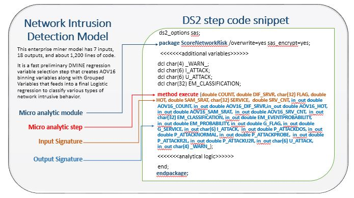

# Micro Analytic Score (MAS) API
SAS Micro Analytic Service is an analytics execution engine with an emphasis on small footprint and high-speed transaction processing rather than batch processing. 
The Micro Analytic Score API enables SAS analytics, in the form of a micro analytic service module, to be embedded within or alongside a device and provide in-memory execution of SAS analytics and logic. Other uses of this API are applications that require decision making into near real-time and transaction-based production systems. For these applications, micro analytic modules are loaded and executed to provide the near real-time decision results.

DS2 code, analytic store (ASTORE), and open-source Python code can be compiled by the Micro Analytic Score API and stored in memory as individual steps that are available for execution. Here is the domain terminology that is associated with this functionality:

* micro analytic module: the packaged and compiled analytics 
* micro analytic step: the individual units that comprise a module 

When a module is compiled and available in memory, the published micro-analytic steps are available for execution. Only steps of public modules can be executed externally by a client. Private modules are reusable analytic code components. Though they are not directly available for execution, they are used to compose larger and more complex public modules.

Every step requires input data to execute and generate output. The description of the input and output data is called the signature.
When input data is submitted for execution, the Micro Analytic Score API validates the data against the signature before executing it.

Complex and large modules might take a long time to compile. The Micro Analytic Score API supports the ability to submit these modules asynchronously, so that the caller does not have to wait for the compilation to complete.
Instead, the caller can check the compilation status after submission.

The Micro Analytic Score API supports executing steps in three different ways:

* Synchronous: The step is executed as soon as the input data is received and the output is returned immediately.
* Fire and forget: The input data is queued for execution and control is returned to the caller.
* Execution with time-out: The step is executed as soon as the input data is received. If the execution completes within the specified time, the output is returned.


#### DS2 Source Code Format

DS2 source, such as SAS Model Manager projects or SAS Enterprise Miner models, can be used by the Micro Analytic API.



A complete code example is <a href="https://developer.sas.com/examples/ExampleScoreCode.sas" target="_blank">here</a>.

#### Module Life Cycle

A compiled micro analytic module stays compiled during the lifetime of the server session in which it was compiled, even when dependent modules are later updated.

The Micro Analytic Score API manages the persistence of the modules by keeping metadata about the modules. This ensures that when the service restarts, there is enough information to re-create the existing modules.
However, when the modules are loaded into memory again, they might have different addresses than they previously did. Therefore, each reload of the modules requires that they be recompiled.

#### Statelessness

State is not maintained between executions of the same micro analytic module.


## API Request Examples Grouped by Object Type

These examples are written in [UnRAVL](https://github.com/sassoftware/unravl).

<details>
<summary>Modules</summary>

* [Create a Module](#create-module)
* [Retrieve a Step](#retrieve-step)
* [Validate Input Values](#validate-input-values)
* [Execute the Step Synchronously](#execute-step-normal)
* [Execute the Module Step Asynchronously](#execute-step-nowait)
* [Execute the Module Step with Time-out (execution completed before time-out period)](#execute-step-wait-completed)
* [Execute the Module Step with Time-out(execution not completed before the time-out period)](#execute-step-wait-timedOut)
</details>

<details>
<summary>Jobs</summary>

* [Create a Module Asynchronously](#create-a-module-asynchronously)
</details>

#### <a name="create-module">Create a Module </a>

Publish the DS2 source into memory so that it is available to be executed. This takes a module definition and returns the compiled and loaded module details. 

In the returned module, the list of steps are visible. These are needed for the subsequent examples.

```
json {
    "POST" : "http://www.example.com/microanalyticScore/modules",
    "headers": {
        "Accept" : "application/vnd.sas.microanalytic.module",
        "Content-Type": "application/vnd.sas.microanlytic.module.definition"
    },
    "body": {
       "version": "2",
       "description": "Sample module",
       "scope" : "public",
       "type" : "text/vnd.sas.source.ds2",
       "properties" : [],
       "code" : "ds2_options sas;\n package sampleModule / overwrite=yes; \n \n method copy_charN_array(char(12) in_array[4], in_out char(12)  out_array[4]);\n out_array := in_array;\n end;\n \n method copy_varchar_array(varchar(512) in_array[3], in_out varchar out_array[3]);\n out_array := in_array;\n end;\n \n method copy_int_array(int in_array[5], in_out int out_array[5]);\n out_array := in_array;\n end;\n \n method copy_float_array(double in_array[2], in_out double out_array[2]);\n out_array := in_array;\n end;\n \n method copy_bigint_array(bigint in_array[1], in_out bigint out_array[1]);\n out_array := in_array;\n end;\n \n method copy_arrays( char(12) in_charN_array[4],\n varchar(512) in_varchar_array[1],\n int in_int_array[5], \n double in_double_array[2], \n bigint in_bigint_array[1], \n in_out char(12)  out_charN_array[4],\n in_out varchar(512) out_varchar_array[1],\n in_out int out_int_array[5],\n in_out double out_double_array[2],\n in_out bigint out_bigint_array[1]);\n \n copy_charN_array(in_charN_array, out_charN_array);\n copy_int_array(in_int_array, out_int_array);\n copy_float_array(in_double_array, out_double_array);\n copy_bigint_array(in_bigint_array, out_bigint_array);\n \n end;\n \n endpackage;\n \n \n"
    },
    "assert" : [
        { 
            "headers" : { 
                "Content-Type": "application/vnd.sas.microanalytic.module+json;charset=UTF-8"
            }
        },
        { 
            "body": {  
                "links":[  
                    {  
                        "method":"GET",
                        "rel":"self",
                        "uri":"/microanalyticScore/modules/36af8e3c-6a37-4494-a8e0-9cc96ad62232",
                        "type":"application/vnd.sas.microanalytic.module"
                    },
                    {  
                        "method":"GET",
                        "rel":"up",
                        "uri":"/microanalyticScore/modules",
                        "type":"application/vnd.sas.collection"
                    },
                    {  
                        "method":"GET",
                        "rel":"source",
                        "uri":"/microanalyticScore/modules/36af8e3c-6a37-4494-a8e0-9cc96ad62232/source",
                        "type":"application/vnd.sas.microanalytic.module.source"
                    },
                    {  
                        "method":"GET",
                        "rel":"steps",
                        "uri":"/microanalyticScore/modules/36af8e3c-6a37-4494-a8e0-9cc96ad62232/steps",
                        "type":"application/vnd.sas.collection"
                    },
                    {  
                        "method":"PUT",
                        "rel":"update",
                        "uri":"/microanalyticScore/modules/36af8e3c-6a37-4494-a8e0-9cc96ad62232",
                        "type":"application/vnd.sas.microanalytic.module"
                    },
                    {  
                        "method":"DELETE",
                        "rel":"delete",
                        "uri":"/microanalyticScore/modules/36af8e3c-6a37-4494-a8e0-9cc96ad62232"
                    }
                ],
                "description":"Sample module",
                "version":2,
                "scope":"public",
                "id":"36af8e3c-6a37-4494-a8e0-9cc96ad62232",
                "stepids":[  
                    "copy_arrays",
                    "copy_bigint_array",
                    "copy_charN_array",
                    "copy_float_array",
                    "copy_int_array",
                    "copy_varchar_array",
                    "test_all_types"
                ],
                "properties":[],
                "revision":1,
                "creationTimeStamp":"2015-05-06T22:14:17.000-0400",
                "modifiedTimeStamp":"2015-05-06T22:14:17.000-0400",
                "name":"samplemodule"
            }
        }
    ]
}
```

#### <a name="retrieve-step"> Retrieve a Step </a>

Using the information returned from creating a module or accessing a module from the modules collection, access a step by its step ID.

This returns the input information that is needed to build the validation and execution queries.

```
json {
    "GET": "http://www.example.com/microanalyticScore/modules/36af8e3c-6a37-4494-a8e0-9cc96ad62232/steps/test_all_types",
    "headers": {
        "Accept": "application/vnd.sas.microanalytic.module.step"
    },
    "assert": [
        { 
            "headers": { 
                "Content-Type": "application/vnd.sas.microanalytic.module.step+json;charset=UTF-8"
            }
        },
        { 
            "body": {
                "id": "test_all_types",
                "moduleId": "36af8e3c-6a37-4494-a8e0-9cc96ad62232",
                "description": null,
                "inputs": [
                    {
                        "name": "in_string",
                        "type": "string",
                        "dim": 0,
                        "size": 32767
                    },
                    {
                        "name": "in_bigint",
                        "type": "bigint",
                        "dim": 0,
                        "size": 0
                    },
                    {
                        "name": "in_int",
                        "type": "integer",
                        "dim": 0,
                        "size": 0
                    },
                    {
                        "name": "in_double ",
                        "type": "decimal",
                        "dim": 0,
                        "size": 0
                    }
                ],
                "outputs": [
                    {
                        "name": "out_string",
                        "type": "string",
                        "dim": 0,
                        "size": 8
                    },
                    {
                        "name": "out_bigint",
                        "type": "bigint",
                        "dim": 0,
                        "size": 0
                    },
                    {
                        "name": "out_int",
                        "type": "integer",
                        "dim": 0,
                        "size": 0
                    },
                    {
                        "name": "out_double",
                        "type": "decimal",
                        "dim": 0,
                        "size": 0
                    },
                    {
                        "name": "string_arr",
                        "type": "stringArray",
                        "dim": 3,
                        "size": 32767
                    },
                    {
                        "name": "bigint_arr",
                        "type": "bigIntArray",
                        "dim": 3,
                        "size": 0
                    },
                    {
                        "name": "int_arr",
                        "type": "intArray",
                        "dim": 3,
                        "size": 0
                    },
                    {
                        "name": "double_arr",
                        "type": "decimalArray",
                        "dim": 3,
                        "size": 0
                    }
                ],
                "links": [
                    {
                        "method": "GET",
                        "rel": "self",
                        "uri": "/microanalyticScore/modules/36af8e3c-6a37-4494-a8e0-9cc96ad62232/steps/test_all_types",
                        "type": "application/vnd.sas.microanalytic.module.step"
                    },
                    {
                        "method": "GET",
                        "rel": "up",
                        "uri": "/microanalyticScore/modules/36af8e3c-6a37-4494-a8e0-9cc96ad62232/steps",
                        "type": "application/vnd.sas.collection"
                    },
                    {
                        "method": "POST",
                        "rel": "validateStepInput",
                        "uri": "/microanalyticScore/commons/validations/modules/36af8e3c-6a37-4494-a8e0-9cc96ad62232/steps/test_all_types",
                        "type": "application/vnd.sas.validation"
                    },
                    {
                        "method": "POST",
                        "rel": "execute",
                        "uri": "/microanalyticScore/modules/36af8e3c-6a37-4494-a8e0-9cc96ad62232/steps/test_all_types",
                        "type": "application/vnd.sas.microanalytic.module.step.output"
                    }
                ],
                "version": 1
            }
        }
    ]
}
```


#### <a name="validate-input-values">Validate Input Values</a>

In the following example, the inputs are valid:

```
json {
    "POST": "http://www.example.com/microanalyticScore/commons/validations/modules/36af8e3c-6a37-4494-a8e0-9cc96ad62232/steps/test_all_types",
    "headers": {
        "Accept" : "application/vnd.sas.validation",
        "Content-Type": "application/vnd.sas.microanlytic.module.step.input"
    },
    "body": {
        "inputs": [
            {
                "name": "in_string",
                "value": "This is a test..."
            },
            {
                "name": "in_bigint",
                "value": 987654321
            },
            {
                "name": "in_int",
                "value": 7654321
            },
            {
                "name": "in_double",
                "value": 0.9997
            }
        ]
    },
    "assert": [
        { 
            "headers": { 
                "Content-Type": "application/vnd.sas.validation+json;charset=UTF-8"
            }
        },
        {
            "body": {
  				"version" : 1,
  				"valid" : true
			}
        }
    ]
}
```

If the inputs are invalid, the response body would be similar to what is shown in the following example.

```
json {
  "version" : 1,
  "error" : {
    "errorCode" : 0,
    "message" : "Cannot assign \"this is a string\" to parameter \"inInt\" of type \"integer\". ",
    "links" : [ ],
    "version" : 2,
    "httpStatusCode" : 400
  },
  "valid" : false
}
```


#### <a name="execute-step-normal">Execute the Step Synchronously and Return the Results</a>

Using the inputs that were validated in [Validate Input Values](#validate-input-values), execute the step and receive the resulting output. Because no value is specified for the `waitTime` parameter, the call returns only after the execution is complete. Upon successful execution, the `outputs` variable in the reply contains the output of the execution.  The `executionState` variable in the reply is assigned the value "completed".

```
json {
    "POST": "http://www.example.com/microanalyticScore/modules/36af8e3c-6a37-4494-a8e0-9cc96ad62232/steps/test_all_types",
    "headers": {
        "Accept" : "application/vnd.sas.microanalytic.module.step.input",
        "Content-Type": "application/vnd.sas.microanlytic.module.step.output"
    },
    "body": {
        "inputs": [
            {
                "name": "in_string",
                "value": "This is a test..."
            },
            {
                "name": "in_bigint",
                "value": 987654321
            },
            {
                "name": "in_int",
                "value": 7654321
            },
            {
                "name": "in_double",
                "value": 0.9997
            }
        ]
    },
    "assert": [
        { 
            "headers": { 
                "Content-Type": "application/vnd.sas.microanalytic.module.step.output+json;charset=UTF-8"
            }
        },
        {
            "body": {
                "moduleId": "0BCA724F-53D7-3540-8A62-4E2731D69813",
                "stepId": "test_all_types",
                "executionState": "completed",
                "output": [
                    {
                        "name": "out_string",
                        "value": "This is a test..."
                    },
                    {
                        "name": "out_bigint",
                        "value": 987654321
                    },
                    {
                        "name": "out_int",
                        "value": 7654321
                    },
                    {
                        "name": "out_double",
                        "value": 0.9997
                    },
                    {
                        "name": "string_arr",
                        "value": [
                          "This is a test...",
                          "This is a test...",
                          "This is a test..."
                        ]
                    },
                    {
                        "name": "bigint_arr",
                        "value": [
                          987654321,
                          987654321,
                          987654321
                        ]
                    },
                    {
                        "name": "int_arr",
                        "value": [
                          7654321,
                          7654321,
                          7654321
                        ]
                    },
                    {
                        "name": "double_arr",
                        "value": [
                          0.9997,
                          0.9997,
                          0.9997
                        ]
                    }
                ],
                "version": 2            }
        }
    ]
}
```

#### <a name="execute-step-nowait">Execute Module Step Asynchronously</a>

Using the `waitTime` query parameter with an assigned value of 0 (zero), validate the module step inputs, submit for execution, and return immediately. The `outputs` variable in the reply is empty and the `executionState` variable in the reply is assigned the value "submitted". The output of the step execution is ignored. Any errors that occur while executing the step are logged.


```
json {
    "POST": "http://www.example.com/microanalyticScore/modules/36af8e3c-6a37-4494-a8e0-9cc96ad62232/steps/test_all_types?waitTime=0",
    "headers": {
        "Accept" : "application/vnd.sas.microanalytic.module.step.input",
        "Content-Type": "application/vnd.sas.microanlytic.module.step.output"
    },
    "body": {
        "inputs": [
            {
                "name": "in_string",
                "value": "This is a test..."
            },
            {
                "name": "in_bigint",
                "value": 987654321
            },
            {
                "name": "in_int",
                "value": 7654321
            },
            {
                "name": "in_double",
                "value": 0.9997
            }
        ]
    },
    "assert": [
              { 
            "headers": { 
                "Content-Type": "application/vnd.sas.microanalytic.module.step.output+json;charset=UTF-8"
            }
        },
        {
            "body": {
                "moduleId": "0BCA724F-53D7-3540-8A62-4E2731D69813",
                "stepId": "test_all_types",
                "executionState": "submitted",
                "outputs": [ ],
                "version": 2
            }
        }
    ]
}
```

#### <a name="execute-step-wait-completed">Execute the Module Step with Time-out (execution completed before time-out period)  </a>

Validate the module step inputs and submit for execution. If the execution completes within specified `waitTime` parameter value, the `outputs` variable in the reply is populated with the output of the execution. The `executionState` variable in the reply has the value 'completed'. 

```
json {
    "POST": "http://www.example.com/microanalyticScore/modules/36af8e3c-6a37-4494-a8e0-9cc96ad62232/steps/test_all_types?waitTime=200",
    "headers": {
        "Accept" : "application/vnd.sas.microanalytic.module.step.input",
        "Content-Type": "application/json"
    },
    "body": {
        "inputs": [
            {
                "name": "in_string",
                "value": "This is a test..."
            },
            {
                "name": "in_bigint",
                "value": 987654321
            },
            {
                "name": "in_int",
                "value": 7654321
            },
            {
                "name": "in_double",
                "value": 0.9997
            }
        ]
    },
    "assert": [
        { 
            "headers": { 
                "Content-Type": "application/vnd.sas.microanalytic.module.step.output+json;charset=UTF-8"
            }
        },
        {
            "body": {
                "version": 2,
                "moduleId": "0BCA724F-53D7-3540-8A62-4E2731D69813",
                "stepId": "test_all_types",
                "executionState": "completed",
                "output": [
                    {
                        "name": "out_string",
                        "value": "This is a test..."
                    },
                    {
                        "name": "out_bigint",
                        "value": 987654321
                    },
                    {
                        "name": "out_int",
                        "value": 7654321
                    },
                    {
                        "name": "out_double",
                        "value": 0.9997
                    },
                    {
                        "name": "string_arr",
                        "value": [
                          "This is a test...",
                          "This is a test...",
                          "This is a test..."
                        ]
                    },
                    {
                        "name": "bigint_arr",
                        "value": [
                          987654321,
                          987654321,
                          987654321
                        ]
                    },
                    {
                        "name": "int_arr",
                        "value": [
                          7654321,
                          7654321,
                          7654321
                        ]
                    },
                    {
                        "name": "double_arr",
                        "value": [
                          0.9997,
                          0.9997,
                          0.9997
                        ]
                    }
                ]
               
            }
        }
    ]
}
```
#### <a name="execute-step-wait-timedOut">Execute the Module Step with Time-out (execution not completed before the time-out period)</a>

Validate the module step inputs and submit for execution. If the execution does not complete within specified wait time, the `outputs` variable in the reply is empty and the `executionState` variable in the reply is assigned the value `timedOut`. 

```
json {
    "POST": "http://www.example.com/microanalyticScore/modules/36af8e3c-6a37-4494-a8e0-9cc96ad62232/steps/test_all_types?waitTime=200",
    "headers": {
        "Accept" : "application/vnd.sas.microanalytic.module.step.input",
        "Content-Type": "application/json"
    },
    "body": {
        "inputs": [
            {
                "name": "in_string",
                "value": "This is a test..."
            },
            {
                "name": "in_bigint",
                "value": 987654321
            },
            {
                "name": "in_int",
                "value": 7654321
            },
            {
                "name": "in_double",
                "value": 0.9997
            }
        ]
    },
    "assert": [
       { 
            "headers": { 
                "Content-Type": "application/vnd.sas.microanalytic.module.step.output+json;charset=UTF-8"
            }
        },
        {
            "body": {
                "moduleId": "0BCA724F-53D7-3540-8A62-4E2731D69813",
                "stepId": "test_all_types",
                "executionState": "timedOut",
                "outputs": [ ],
                "version": 2
            }
        }
    ]
}
```

#### <a name="create-a-module-asynchronously">Create a Module Asynchronously</a>

Create a job to asynchronously publish DS2 source into memory. This takes a module definition and returns job metadata. In the returned job metadata, the current state of the job is visible.

```
json {
    "POST" : "http://www.example.com/microanalyticScore/jobs",
    "headers": {
        "Accept" : "application/vnd.sas.microanalytic.module",
        "Content-Type": "application/vnd.sas.microanlytic.job"
    },
    "body": {
       "version": "2",
       "description": "Sample module",
       "scope" : "public",
       "type" : "text/vnd.sas.source.ds2",
       "properties" : [],
       "code" : "ds2_options sas;\n package sampleModule / overwrite=yes; \n \n method copy_charN_array(char(12) in_array[4], in_out char(12)  out_array[4]);\n out_array := in_array;\n end;\n \n method copy_varchar_array(varchar(512) in_array[3], in_out varchar out_array[3]);\n out_array := in_array;\n end;\n \n method copy_int_array(int in_array[5], in_out int out_array[5]);\n out_array := in_array;\n end;\n \n method copy_float_array(double in_array[2], in_out double out_array[2]);\n out_array := in_array;\n end;\n \n method copy_bigint_array(bigint in_array[1], in_out bigint out_array[1]);\n out_array := in_array;\n end;\n \n method copy_arrays( char(12) in_charN_array[4],\n varchar(512) in_varchar_array[1],\n int in_int_array[5], \n double in_double_array[2], \n bigint in_bigint_array[1], \n in_out char(12)  out_charN_array[4],\n in_out varchar(512) out_varchar_array[1],\n in_out int out_int_array[5],\n in_out double out_double_array[2],\n in_out bigint out_bigint_array[1]);\n \n copy_charN_array(in_charN_array, out_charN_array);\n copy_int_array(in_int_array, out_int_array);\n copy_float_array(in_double_array, out_double_array);\n copy_bigint_array(in_bigint_array, out_bigint_array);\n \n end;\n \n endpackage;\n \n \n"
    },
    "assert" : [
        { 
            "headers" : { 
                "Content-Type": "application/vnd.sas.microanalytic.module+json;charset=UTF-8"
            }
        },
        { 
            "body": {  
                "links":[  
                    {  
                        "method":"GET",
                        "rel":"self",
                        "uri":"/microanalyticScore/jobs/36af8e3c-6a37-4494-a8e0-9cc96ad62232",
                        "type":"application/vnd.sas.microanalytic.job"
                    },
                    {
                        "method":"GET",
                        "rel":"up",
                        "uri":"/microanalyticScore/jobs",
                        "type":"application/vnd.sas.collection"
                    },
                    {
                        "method":"DELETE",
                        "rel":"delete",
                        "uri":"/microanalyticScore/jobs/36af8e3c-6a37-4494-a8e0-9cc96ad62232"
                    }
                ],
                "version": 1,
                "description": "Sample module",
                "id": "36af8e3c-6a37-4494-a8e0-9cc96ad62232",
                "moduleId": "sampleModule",
                "state": "pending",
                "errors": [],
                "creationTimeStamp": "2019-01-06T22:14:17.000-0400",
                "modifiedTimeStamp": "2019-01-06T22:14:17.000-0400"
            }
        }
    ]
}
```


version 3, last updated 08 May, 2019