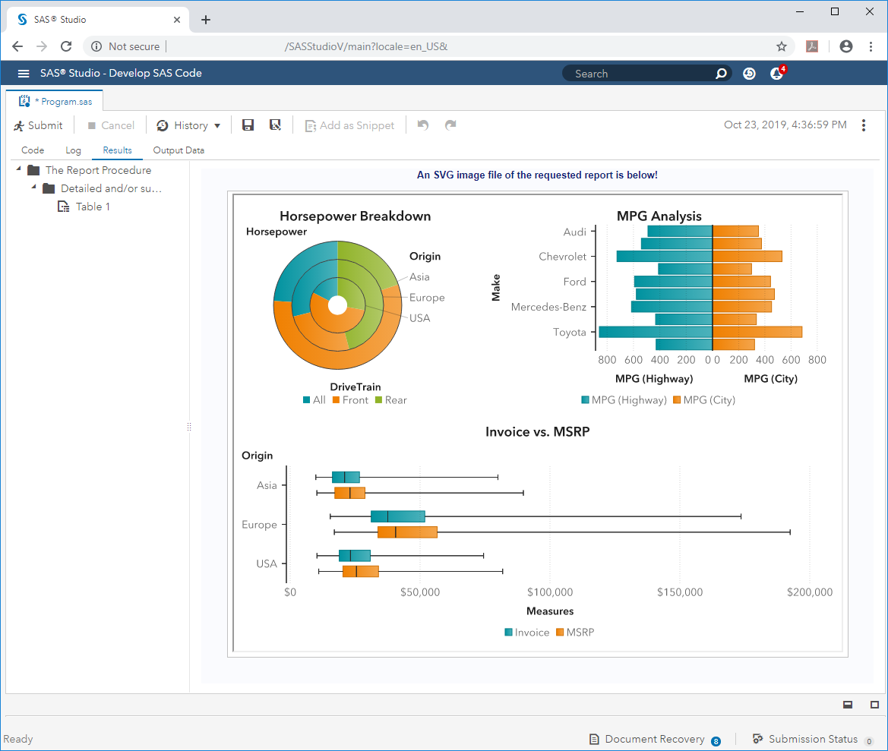

One of the most useful features of the [SAS® Viya REST API](https://developer.sas.com/apis/rest/) is the ability to leverage the reportImages service to generate SVG images of Visual Analytics Report(s).  This is particularly useful for SAS developers who are making updates to a report's data source(s) and would like to get a quick view of how these changes are reflected in Visual Analytics.  More information on this service can be found on the reportImages' developer.sas.com [page](https://developer.sas.com/apis/rest/Visualization/#report-images)

The SAS code in this folder uses the reportImages service to programmatically open a Visual Analytics report and generate an SVG image from it.  When the program finishes the SVG image is displayed in SAS Studio's results tab.  This allows the SAS developer to instantly get a view of the Visual Analytics report's current state.

The image above shows an SVG image of a SAS Visual Analytics report (created via the reportImages service) presented in the SAS Studio results tab.

Code Prerequisites:

* All code included in this folder must be submitted in a SAS Studio 5.1 (or later) session within a Viya 3.4 (or later) environment which contains the SAS Viya services that are being called. 
* The Visual Analytics Report's URI must be placed in the macro call at the bottom of the code
    * example: %create_VA_svg_image(/reports/reports/9d9d1a82-1e39-4284-a278-c3a05388ea72)
* All of the report's data sources are have been lifted into memory as CAS Datasets

Notes:
* This code by default creates an svg image with dimensions of 800x600.  This default size can be changed by placing different values in the two %let statements at the top of the code
* By default, the reportImages service renders an SVG image of the first tab in a Visual Analytics report.  If you would like to have it create an SVG image of a different tab you can do so by adding the sectionIndex parameter to the API call.  More information on the reportImages service parameters can be found on [developer.sas.com](https://developer.sas.com/apis/rest/Visualization/#operations-2)
